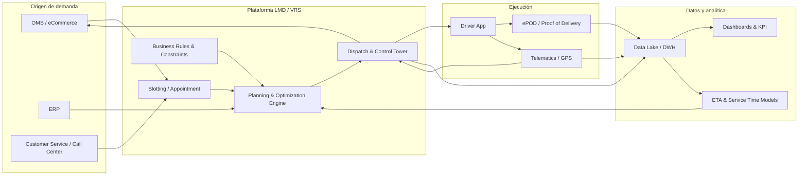

# Soluciones comerciales para optimización de ruteo y última milla

## Resumen ejecutivo

El mercado de “última milla” (Last‑Mile Delivery, LMD) se puede entender como tres capas tecnológicas, que a menudo se combinan en una misma implementación: (a) **plataformas end‑to‑end de última milla** (orquestan desde checkout/slots hasta ejecución, prueba de entrega, experiencia del cliente y analítica), (b) **soluciones VRS/optimización avanzada** (vehicle routing & scheduling) orientadas a planificación táctica/operativa compleja (múltiples depósitos, reglas de negocio ricas, grandes volúmenes y control detallado), y (c) **APIs de optimización/ruteo** que ofrecen “routing as a service” para integrarlas en un producto propio (p. ej., Route Optimization API). citeturn32view0turn47view0turn40search3

La propuesta de valor típica de estas soluciones se centra en reducir costo‑a‑servir y elevar nivel de servicio en un entorno altamente incierto (tráfico, ausencias, cancelaciones, cambios de prioridad). En fuentes no académicas pero operacionales, se reporta que la última milla puede representar una fracción muy alta del costo de envío total; por ejemplo, **DHL** cita que “en promedio” el último tramo puede superar **53%** del costo total de envío. citeturn22view0 En paralelo, un reporte de **McKinsey & Company** sitúa costos por paquete de última milla en un rango aproximado de **€1,50 a >€4,00** según densidad/red y geografía; y destaca potencial de automatización para reducir costos urbanos ~**10–40%** en escenarios de vehículos semi/autónomos. citeturn27view1turn28view0

En lo comercial, la señal más importante es que **los modelos de precio se han estandarizado** en tres familias fácilmente mapeables a tu caso: **por conductor/vehículo** (SaaS SMB/scale‑up), **por orden/tarea/stop** (útil cuando la flota es variable o se subcontrata por demanda), y **por consumo API** (por request y/o por “shipments/vehicles” dentro del request). citeturn30view0turn31view0turn40search0 En lo técnico, casi ningún vendedor detalla su algoritmo exacto; por ello conviene separar “capacidad funcional” (restricciones que soporta, reoptimización, SLA) de “método” (exacto vs heurístico/ML) y exigir evidencia de desempeño con tus datos. Esta recomendación aparece explícitamente en guías de selección y whitepapers de proveedores: pruebas con datasets iguales durante preventa, atención a geocodificación y acople con ejecución. citeturn25view1turn51view2

## Panorama de proveedores y modelos comerciales

La tabla siguiente prioriza proveedores con presencia global y también incluye un actor regional relevante en LatAm. Cuando el precio no está públicamente publicado, se marca como **no especificado** (típico de enterprise).  

| Proveedor | Tipo de solución | Despliegue (SaaS / on‑prem / híbrido) | Modelo de precio observado públicamente | Cliente objetivo (tamaño/sector) | Evidencia pública clave |
|---|---|---|---|---|---|
| entity["company","Onfleet","last-mile delivery software"] | Plataforma LMD (dispatch + driver app + tracking + POD) | SaaS (cloud) | Suscripción mensual por plan con “tasks” incluidas (p. ej., Launch desde **$599/mes** con 2.500 tasks; Enterprise desde **$2.999/mes**). Define “task” y cuándo se factura (cuando llega a *Completed*). | Operaciones pequeñas a medianas y también enterprise; courier/retail/food/health | Planes, funcionalidades (POD, auto‑dispatch, reporting), definición de task. citeturn29view0 |
| entity["company","OptimoRoute","route optimization software"] | Optimización de rutas + app conductor + tracking + POD | SaaS | Precio por **conductor/mes** (Lite ~**$35,10** y Pro ~**$44,10** facturado anual), límites de “orders at once”; plan Custom. | SMB y mid‑market con planificación diaria; delivery + field service | Lista de features (tracking, API, POD) y pricing. citeturn30view0 |
| entity["company","Routific","route optimization software"] | Optimización + driver app + tracking + POD | SaaS | **Por orden/mes**: gratis hasta 100; **$150** hasta 1.000; luego escalas con $/order. Indica cambio desde modelo por vehículo en **mid‑2024**. | SMB con volumen variable; útil cuando la flota cambia mucho | Pricing por orden, features incluidos, racional del modelo. citeturn31view0 |
| entity["company","SimpliRoute","route optimization latam"] | Suite logística (optimización + monitoreo + POD + analítica) | SaaS (cloud) | No especificado en sitio (en algunos comparadores aparece “por vehículo/mes”, pero no es fuente oficial). | Empresas en LatAm (retail/consumo masivo/distribución) | Página en español con descripción de algoritmos (BigRVP/JDH/Simplify), tráfico en tiempo real, capacidades (zonas, obstáculos, pickup&delivery). citeturn35view0 |
| entity["company","Bringg","last-mile delivery platform"] | Plataforma LMD modular (checkout/slots → planificación → dispatch → driver → CX) | SaaS (enterprise) sobre infraestructura cloud | No especificado (enterprise) | Retailers, 3PL y operaciones omnicanal complejas (flota propia + terceros) | Módulos (shopping/plan/dispatch/drive/CX), slots dinámicos, APIs/webhooks, claims de resultados. citeturn32view0turn8search14 |
| entity["company","FarEye","last-mile delivery platform"] | Plataforma de última milla (opciones/slots, ruteo, ejecución, hub ops, returns) | Predominantemente SaaS (enterprise) | No especificado (enterprise) | Enterprise (e‑commerce, courier, big&bulky, grocery, pharma) | Capacidades (opciones y slots, AI route planning, driver app) y métricas publicadas (OTIF, km ahorrados, reducción costo). citeturn33view0 |
| entity["company","Locus","locus.sh logistics software"] | Plataforma de optimización + dispatch (enterprise) | SaaS (enterprise) | No especificado | Enterprise multi‑ciudad/alto volumen | Features: geocoding propio, clubbing, planificación scheduled+on‑demand, rerouting, integraciones vía REST; app offline. citeturn34view0 |
| entity["company","The Descartes Systems Group","logistics software company"] | VRS + ejecución móvil + telemática; variantes on‑demand y enterprise | SaaS (On‑demand) + on‑prem (enterprise) | No especificado (en on‑demand se describe como “easy and affordable”; un documento histórico menciona suscripción pay‑as‑you‑go). | Mid‑market y enterprise con alta complejidad (multi‑vehículo/multi‑site) | On‑demand cloud + GPS mobile; continuo/dinámico; documento señala opción on‑prem enterprise y autoservicio de reservas. citeturn47view0turn49view0turn49view1turn46search11 |
| entity["company","ORTEC","optimization software company"] | VRS + dispatch (SaaS) y suite de optimización | SaaS | No especificado | Manufacturer/retail/wholesale/transport; planificación multiusuario y ejecución | Página indica “single SaaS solution” con capacity planning, scheduling, assignments, dispatch y ejecución; soporte de planificación + ejecución en tiempo real. citeturn39search0 |
| entity["company","Aptean","enterprise software vendor"] | Routing & Scheduling (Paragon) | SaaS (Aptean Cloud) + historial on‑prem | No especificado | Operaciones complejas y alto volumen | Datasheet: SaaS, escalabilidad dinámica, **99,9% uptime** (claim), updates multi‑tenant; lanzamiento de Paragon Route 360 en cloud. citeturn38view1turn4search2turn4search14 |
| entity["company","PTV Logistics","routing software company"] | Route optimisation + APIs (xServer/OptiFlow) | Híbrido (desktop + cloud) + APIs | No especificado | Mid‑market/enterprise; planificación robusta con mapas/telemática | Whitepaper: importancia de geocoding, tráfico histórico + real‑time, incremental planning; muestra versión desktop y cloud. citeturn25view1turn36view0turn4search1 |
| entity["company","Google","technology company"] | API de optimización (Route Optimization API / ex Cloud Fleet Routing) | API SaaS | **Pay‑as‑you‑go por request** basado en #shipments y SKU; documentación de usage/billing y pricing. | Equipos dev que construyen solución propia o amplían un TMS/LMD existente | Docs: definición, constraints (capacidad/load limits), cost model, billing. citeturn40search0turn40search3turn40search5 |

Lectura de mercado: los proveedores “plataforma LMD” suelen cubrir slots, experiencia cliente y ejecución; los “VRS enterprise” profundizan en modelar restricciones, escenarios y procesos; y las “APIs” maximizan flexibilidad técnica pero transfieren al equipo interno el costo de construir ejecución, UX y analítica. citeturn32view0turn51view2turn40search3

## Capacidades funcionales y arquitectura técnica

### Núcleo de optimización y algoritmos

En problemas de ruteo, el estándar industrial es ofrecer un “motor” que toma objetivos (minimizar km/tiempo/costo, maximizar cumplimiento SLA, balancear carga) y un conjunto grande de restricciones (capacidad, ventanas, habilidades, prioridades, reglas por cliente/vehículo). **SimpliRoute** explicita tres algoritmos (“BigRVP”, “JDH”, “Simplify”) y el uso de tráfico en tiempo real y aprendizaje automático. citeturn35view0 **Bringg** y **Descartes** enfatizan “optimización continua/dinámica” y tradeoffs multi‑objetivo (KPI impacts). citeturn32view0turn46search11 **Google** expone un modelo formal y programático: el request define objetivos y constraints (p. ej., *load demands/limits* para capacity) y costos abstractos que tú defines. citeturn40search3turn40search5turn40search6

Como referencia académica (útil para evaluar claims de “IA”): la literatura reciente resume que, por la naturaleza combinatoria del VRP, se usan familias de **heurísticas constructivas** (nearest neighbor, insert, savings, sweep), **mejoras locales**, y **metaheurísticas**; además crecen los enfoques de “diseño automático” y “ML‑assisted heuristics”. citeturn42view0turn42view1 En última milla, el modelado de **delivery options** (múltiples ubicaciones/ventanas por pedido, lockers/pick‑up points) y la necesidad de manejar capacidad de ubicaciones compartidas es un tema formalizado en VRPDO; el paper destaca que los fallos de primera entrega generan reproceso y elevan costos del carrier. citeturn44view0turn44view1

### Funcionalidades “must‑have” en última milla

**Gestión de slots y citas (appointment/slot management) y reserva de capacidad.** En soluciones omnicanal, el slot no es sólo una ventana informativa: es una **decisión de capacidad**. **Bringg** describe slots dinámicos en checkout basados en datos en tiempo real (órdenes, horarios, capacidad) y también expone API para crear ventanas planificadas, indicando explícitamente la posibilidad de **reservar slots hasta el checkout**, definir ventanas estrechas (p. ej., 30 minutos) y publicar slots hacia adelante (hasta un mes). citeturn32view0turn8search14 **FarEye** también posiciona “delivery options/slots” como parte central de planificar capacidad y combinar flota propia con crowdsourced. citeturn33view0

**Dispatch dinámico y reoptimización.** En operación real, el plan “batch” se rompe: se necesita reasignar, insertar, re‑secuenciar. **Locus** describe rerouting ante disrupciones (tráfico, cancelaciones, urgencias) y planificación “scheduled + on‑demand” en un mismo sistema. citeturn34view0 **Descartes** formaliza “continuous optimization” como proceso iterativo que actualiza soluciones a medida que entran nuevas órdenes. citeturn46search11

**Prueba de entrega (POD / ePOD) y requerimientos de cierre.** En SaaS SMB, POD suele estar incluido en planes estándar (p. ej., **Onfleet** incluye “photo and signature proof of delivery” y en planes superiores permite “customized completion requirements”). citeturn29view0 **OptimoRoute** y **Routific** listan POD como parte de sus planes. citeturn30view0turn31view0 **Descartes On‑demand** menciona capturar POD como parte del flujo. citeturn47view0

**Tracking en tiempo real, ETAs y visibilidad.** La visibilidad suele venir de dos fuentes: GPS de app del conductor y/o telemática. **Descartes** y **Bringg** describen mapas en tiempo real y actualización dinámica de ETAs; Descartes menciona que datos GPS actualizan el dispatch y alertan desviaciones. citeturn47view0turn32view0 **Routific** incluye “real‑time GPS tracking” y tracker al cliente. citeturn31view0

**Integración y APIs.** Integración “de verdad” hoy significa: ingestión de órdenes (OMS/ERP/e‑commerce), publicación de rutas a ejecución (driver app), retorno de eventos (estatus, geocercas, POD) y webhooks para automatizar workflows. En fuentes oficiales: **Onfleet** declara que su API es un servicio REST. citeturn7search0 **Bringg** documenta webhooks y también posiciona “open REST APIs and webhooks” como capacidad fundacional. citeturn7search1turn32view0 **FarEye** publica un portal de APIs de integración. citeturn7search2 **Locus** ofrece documentación de API y menciona creación de batches vía REST. citeturn7search3turn34view0

**Multi‑depósito / multi‑región.** Este requisito separa SMB vs enterprise. **Onfleet Enterprise** menciona soporte “multi‑region”. citeturn29view0 **Descartes** (documento) describe explícitamente un perfil enterprise “multiple vehicles, multiple locations and multiple stops” y, además, capacidades como self‑scheduling de reservas vía web. citeturn49view0

**Planificación de turnos/crew scheduling.** No todos los LMD lo cubren. Aquí aparecen suites especializadas de optimización de fuerza laboral: **ORTEC Workforce Scheduling** se presenta como soporte end‑to‑end de workforce management (pronóstico → despliegue óptimo → evaluación), con módulos de self‑service, shift bidding, checks en tiempo real, etc. citeturn8search1turn8search4

### Arquitectura de referencia

Una implementación típica (vendor‑agnostic) integra 5 dominios: **origen de demanda**, **motor de planificación**, **ejecución**, **observabilidad/BI**, y **gobierno de datos**. Esta arquitectura es consistente con lo que proveedores describen como integración con sistemas upstream (ERP/OMS/WMS) y downstream (apps móviles/telemática), más analítica plan‑vs‑actual. citeturn25view1turn47view0turn51view2



## Flujos operativos, incertidumbre y escalabilidad

En la práctica, el “producto” que compras no es sólo el solver: es un **workflow operativo** que define cuándo se congela un plan, qué se puede reoptimizar, cómo se comunican cambios a conductores y clientes, y cómo se gobiernan excepciones.

### Workflow operativo típico

1) **Definir promesas al cliente (slots/ETAs)**: en omnicanal, la plataforma calcula ventanas viables considerando capacidad y reglas; Bringg lo describe como “dynamic delivery slots” en checkout y self‑service post‑compra. citeturn32view0turn8search14  
2) **Construir batches / consolidación**: Locus detalla creación de batches y “clubbing” inteligente para densidad. citeturn34view0  
3) **Optimización + asignación de recursos**: PTV enfatiza evaluar cuántas restricciones soporta el motor y recomienda test comparativos con el mismo dataset; también subraya que la calidad de geocodificación afecta optimización y servicio. citeturn25view1turn25view2  
4) **Dispatch y publicación**: Descartes On‑demand describe dispatch electrónico de secuencias/tiempos a móviles y actualización dinámica de ETAs con GPS en ejecución. citeturn47view0  
5) **Ejecución, POD, excepciones**: Bringg posiciona “exception management workflows” y comunicación conductor‑dispatcher; Onfleet agrega auto‑dispatch y requerimientos de cierre configurables según plan. citeturn32view0turn29view0  
6) **Ciclo de mejora (plan vs actual)**: La guía de Descartes explicita que ML sobre datos GPS puede mejorar predicción de drive times, service/stop times y productividad; y que la integración bidireccional ejecución↔planificación permite updates en tiempo real. citeturn51view0turn51view1

### Manejo de incertidumbre

**Tráfico y variabilidad temporal.** Un patrón robusto es combinar data **histórica** (perfiles de velocidad) con data **en tiempo real** (incidentes/obras) y recalcular o amortiguar ETAs. PTV lo describe como dos tipos de información de tráfico que un buen route planner debería usar, y liga esto a recalcular llegada/evitar congestión. citeturn25view1

**Cancelaciones, urgencias y fallos de entrega.** Las plataformas modernas aplican (a) reoptimización incremental/continua, (b) reglas para congelar parte del plan (no siempre se puede reordenar todo), (c) workflows de excepción (reintento, redespacho, reasignación), y (d) diseño de opciones de entrega (slots alternativos, lockers, pick‑up points) para subir primera entrega exitosa. La literatura VRPDO explica formalmente el costo del rework por fallos de primera entrega y cómo “delivery options” y capacidad de ubicaciones compartidas se incorporan como restricciones. citeturn44view0turn44view1

**Escalabilidad computacional y organizacional.** Escalar no es sólo “cloud”; es permitir múltiples usuarios y múltiples optimizaciones simultáneas, con tiempos de respuesta operables. Descartes advierte explícitamente que la sofisticación del solver no implica escalabilidad; menciona técnicas como *horizontal scaling*, *robotic process automation* y *elastic optimization* para problemas grandes. citeturn51view1 En paralelo, Aptean posiciona que su SaaS agrega capacidad de cómputo/recursos conforme crece la necesidad y afirma un **99,9% uptime** (claim). citeturn38view1

### Flow de decisión recomendado para seleccionar solución

```mermaid
flowchart TD
  A[Definir objetivos y restricciones del negocio] --> B[Clasificar operación: SMB vs Enterprise vs Build-with-API]
  B --> C[Inventariar datos disponibles: direcciones, ventanas, capacidades, GPS, tiempos de servicio]
  C --> D[Seleccionar 3-5 vendors candidatos por encaje funcional]
  D --> E[Prueba controlada con mismo dataset y KPIs acordados]
  E --> F{Cumple targets de SLA y costo?}
  F -- No --> D
  F -- Sí --> G[Diseñar integración: OMS/ERP/WMS + Driver App + Telematics + BI]
  G --> H[Piloto operacional (2-6 semanas) con plan vs actual y gestión del cambio]
  H --> I[Rollout por ola + hardening de excepciones + gobierno de datos]
```

## KPIs y benchmarks usados en el mercado

### Definiciones operables y cómo se miden

Un riesgo frecuente es que “delivery”, “order”, “stop” y “task” no significan lo mismo entre vendors. Por ejemplo, **Onfleet** define “task” como pickup o delivery y aclara que, para facturación, se cuentan cuando llegan a estado “Completed” (y pueden completarse desde app, dashboard o API). citeturn29view0 **OptimoRoute** define “order” como acción única (delivery/pickup) y limita cuántas órdenes se pueden planificar “a la vez”, no el volumen diario/mensual. citeturn30view0 **Routific** cuenta cada “order” una sola vez cuando se agenda a una ruta (no por reoptimización) y cambió su pricing desde modelo por vehículo a modelo por orden para flotas variables. citeturn31view0

La siguiente tabla sintetiza KPIs con fórmulas, fuentes de datos y benchmarks públicos (cuando existen). Los “targets” dependen del contexto (B2C/B2B, densidad, promesa de tiempo, mix entrega/retorno); por eso se presentan como **rangos de referencia**.

| KPI | Definición y fórmula | Fuente de datos típica | Benchmarks / referencias públicas |
|---|---|---|---|
| Costo por entrega | (Costos operativos directos + indirectos asignados) / #entregas completadas | ERP/finanzas + tiempos conductor + combustible + peajes + mantenimiento | McKinsey reporta costos por paquete de última milla ~€1,50 a >€4,00 según densidad/geografía; útil como orden de magnitud, no como target universal. citeturn27view1 |
| On‑time delivery % | #entregas dentro de ventana prometida / #entregas con ventana | Eventos de ejecución (arribo, inicio servicio, POD), definición de ventana (slot/SLA) | ParcelPerform reporta “on‑time performance” 98,5% en US en Q2 2025 (benchmark carrier/market). Útil como techo de referencia para promesas de 2‑3 días, no necesariamente para ventanas estrechas. citeturn20search0 |
| First‑attempt delivery success rate | #entregas exitosas en primer intento / #entregas intentadas | Estado de intentos (driver app), motivo fallo, geocercas | ParcelPerform reporta 97,2% (US, 2023) como benchmark; y reportes por ruta/región para Q1 2025. citeturn20search4turn20search5 |
| Reattempt rate | 1 − first‑attempt success | Idem anterior | Se deriva del KPI anterior; VRPDO enfatiza impacto de rework por fallos de primera entrega. citeturn44view0 |
| Entregas por hora (productividad) | #entregas completadas / horas de conducción+servicio | Tiempos GPS + timestamps de servicio + turnos | Routific afirma ver reducciones 15–40% en kilometraje/drive time/tamaño de flota (claim). DHL reporta mejoras de productividad 20–40% con actualización de rutas en tiempo real. citeturn31view0turn22view0 |
| Km por entrega | km totales ejecutados / #entregas completadas | GPS/telemática | Routific y FarEye publican mejoras asociadas a optimización (claims). citeturn31view0turn33view0 |
| Utilización de flota | (tiempo productivo o capacidad usada) / (capacidad total disponible) | Plan vs actual; carga/volumen/peso; turnos | McKinsey menciona que costo de vehículo/equipo puede ser <15% del costo total en redes densas, indicando que los mayores palancas suelen estar en labor/planificación. citeturn27view1 |
| Driver idle time | Tiempo en espera / tiempo total de turno | GPS + estados (waiting/at stop) | Descartes recomienda analítica plan‑vs‑actual y drill‑down a driver/cliente; ML sobre GPS para mejorar parámetros. citeturn51view0 |
| Cancelaciones | #órdenes canceladas / #órdenes creadas | OMS / call center | Locus menciona recalibración ante cancelaciones (capacidad de reroute). citeturn34view0 |
| CSAT / rating post‑entrega | Score promedio de cliente por entrega | Encuestas, app, SMS/email | Bringg menciona notificaciones y ratings como parte del módulo “Delivery Experience”. citeturn32view0 |
| Emisiones CO₂e por entrega | CO₂e total / #entregas | Consumo combustible/energía + distancias + factores de emisión | Para método: ISO 14083 define una metodología común para cuantificar y reportar emisiones en cadenas de transporte; Smart Freight Centre publica el marco GLEC para contabilidad de emisiones logísticas. citeturn21search8turn21search1 |

### “Gráfico” textual de rangos de referencia

Referencias públicas sugieren que, en mercados maduros, **first‑attempt success** puede moverse alrededor de ~88–97% según región/ruta, y “on‑time” en segmentos puede acercarse a ~98% (carrier/mercado). citeturn20search4turn20search0

- First‑attempt success: 88% ▓▓▓▓▓▓▓▓░░ → 97% ▓▓▓▓▓▓▓▓▓▓  
- On‑time (macro‑benchmark): 90% ▓▓▓▓▓▓▓▓░░ → 99% ▓▓▓▓▓▓▓▓▓▓  

Estas bandas deben “aterrizarse” con tu promesa (slot de 15 min vs “2‑day delivery”), densidad y mix de reintentos/locker. citeturn8search14turn44view0

## Evidencia cuantitativa: claims de desempeño y evaluaciones independientes

### Claims de proveedores (útiles como hipótesis, no como garantía)

- **Bringg** publica “real‑world customer results” agregados: 20% ahorro de costo última milla, 87% aumento de dispatch automatizado, 30% aumento de entregas por día, 40% mayor CSAT (claims). citeturn32view0  
- **FarEye** publica métricas: 99,9% OTIF, 75M+ km ahorrados vía optimización, 18% reducción de costo promedio por entrega (claims). citeturn33view0  
- **Locus** publica incrementos sobre gran escala (“650M+ orders”): +25% eficiencia/productividad, +45% entregas, +8% compliance SLA (claims). citeturn34view0  
- **Onfleet** incluye testimonios con rangos cuantitativos: aumento de capacidad 50% por motor de optimización y +10–20% de entregas/día “en el mismo timeframe” (claims). citeturn29view0  
- **Routific** afirma observar reducciones 15–40% en km/drive time/tamaño de flota (claim). citeturn31view0  
- **Descartes** muestra “proven results” (claims) como reducción 75% en tiempo de planificación y +56% productividad en “delivery fleets”. citeturn46search2  
- **DHL** reporta que mejorar la planificación (geo‑map + updates en tiempo real) elevó productividad última milla en 20–40% en algunos mercados (claim contextualizado en su operación). citeturn22view0  

### Evaluaciones y evidencia independiente

- Un artículo académico (Sustainable Cities and Society, 2019) reporta un caso real donde se utilizó ORTEC Routing and Dispatch para optimizar recolección selectiva en Rio de Janeiro, con **reducción de 27,72%** del costo total por cliente en un diseño por “planning regions” y **45,40%** cuando se considera toda la región de recolección (en escenarios analizados). citeturn45view0  
- Un caso publicado por Inbound Logistics reporta resultados al usar Descartes Route Planner On Demand (caso “Blue Sky”), incluyendo un **80%** de salto en eficiencia de fulfillment y tracking en tiempo real, entre otros (nota: caso periodístico, no paper científico). citeturn46search21  
- En literatura académica formal, VRPDO (2020) provee un marco exacto (branch‑price‑and‑cut) para problemas con opciones de entrega y capacidad de ubicaciones compartidas; útil como “ground truth” conceptual para evaluar vendors que prometen slotting/lockers/alternativas. citeturn44view0turn44view1  
- Un survey (arXiv, 2023) sistematiza clases de heurísticas y tendencias de ML‑assisted heuristics; esto es relevante porque muchos vendors describen “IA” sin especificar si es para ETA/parametrización, para búsqueda heurística o para predicción de demanda. citeturn42view0turn42view1  

## Brechas, limitaciones y desafíos de implementación

### Limitaciones típicas de producto y de adopción

**Opacidad algorítmica y dificultad de comparar “calidad de optimización”.** PTV señala que inspeccionar código rara vez ayuda y recomienda comparar herramientas con el mismo dataset; también enfatiza que el número de restricciones modeladas separa un plan “bueno” de uno “óptimo”. citeturn25view1turn25view2 Esto coincide con la guía de Descartes: no hay un estándar único, y cada vendor resuelve un rango de problemas; por lo tanto, se debe focalizar en resultados y cobertura futura. citeturn50view0turn51view2

**Calidad de datos (direcciones, geocoding, tiempos de servicio).** PTV subraya que la precisión de geocoding afecta cálculos, calidad de servicio y resultados operativos; y recomienda soporte de reverse geocoding. citeturn25view1 Locus posiciona “proprietary geocoding engine” como feature para convertir direcciones ambiguas en coordenadas y reducir fallos por error de dirección (claim funcional). citeturn34view0

**Integración con la cadena logística completa.** PTV describe que la optimización debe conectarse con bases upstream (ERP/TMS/WMS) y aplicaciones downstream (navegación/app móvil), idealmente con comunicación en tiempo real para ajustar rutas durante ejecución. citeturn24view0 En la guía de Descartes, se enfatiza que la integración “state of the art” cubre desde cargas batch (archivos) hasta REST APIs en tiempo real, y que la amplitud de interfaces (órdenes, recursos, parámetros) define el esfuerzo real del proyecto. citeturn51view1

**Gestión del cambio (dispatchers, conductores, atención al cliente).** PTV afirma que la implementación cambia procesos y requiere experiencia en change management, involucrando a equipos afectados para asegurar adopción. citeturn24view0 Descartes también señala que la competencia de implementación y entrenamiento es crítica para maximizar resultados. citeturn51view3

**Regulación y compliance.** PTV lista restricciones legales relevantes (tiempos de conducción/descanso, regulaciones ambientales, tiempo de trabajo), y recomienda verificar que el sistema planifique cumpliendo requisitos legales y ambientales. citeturn24view0

### Limitaciones operacionales recurrentes

- **Desfase plan vs realidad**: planes se vuelven obsoletos al salir a ruta por eventos no previstos (múltiples fuentes lo reconocen: Descartes describe continuous optimization; Locus rerouting; PTV incremental planning). citeturn46search11turn34view0turn25view1  
- **Excepciones “largas colas”**: el 5–10% de casos difíciles (direcciones ambiguas, edificios sin acceso, ausencias) consume gran parte de la energía operativa; por eso vendors enfatizan excepción management y dashboards. citeturn32view0turn33view0  
- **Costo de construir con APIs**: Route Optimization API entrega optimización y billing granular, pero el operador debe implementar driver app, POD, customer comms, exception workflows y BI; esto es estratégico si tu diferenciación está en tu producto/operación. citeturn40search0turn47view0turn32view0  

## Recomendaciones, matriz de selección y propuesta de instrumentación de KPIs

### Criterios de selección con matriz de ponderación

Basado en criterios explícitos de guías de evaluación (definir objetivos, constraints, proceso, dataset limpio, integración y despliegue) y en consideraciones operativas (slots, excepciones, plan vs actual), una matriz práctica es:

| Criterio | Peso sugerido | Cómo evaluarlo en RFP / piloto | Justificación |
|---|---:|---|---|
| Encaje funcional “hard constraints” | 25% | Checklist de restricciones (ventanas, capacidades, multi‑depot, skills, pickup&delivery, reglas por zona, congelamiento parcial, etc.) + demo con tu dataset | Más restricciones modeladas → plan más cercano a realidad; clave para cumplir SLA. citeturn25view2turn51view2 |
| Manejo de incertidumbre (reopt, excepciones) | 20% | Prueba con eventos: cancelación, pedido urgente, ausencia, tráfico, breakdown; medir delta de KPIs | Locus/Descartes/Bringg enfatizan rerouting/continuous optimization/exception workflows. citeturn34view0turn46search11turn32view0 |
| Integración y APIs (técnica y operación) | 15% | REST + webhooks + batch import; SDKs; conectores; esfuerzo estimado; latencia | Integración define time‑to‑value y “costo oculto” del proyecto. citeturn7search0turn32view0turn51view1 |
| UX de ejecución (driver app, POD, offline) | 10% | Piloto con conductores; tasa de adopción; errores POD; offline sync | La ejecución genera datos y cierra el loop; Locus menciona offline sync. citeturn34view0turn29view0 |
| Analítica (plan vs actual, drill‑down) | 10% | Dashboards, export BI, definiciones de KPI, retención histórica | ML/analítica sobre GPS mejora parámetros; sin medición no hay mejora. citeturn51view0turn32view0 |
| Seguridad / despliegue / compliance | 10% | SOC2/SSO, multi‑tenant vs private cloud vs on‑prem, data residency | Descartes explicita que aunque cloud sea común, se requiere flexibilidad; Aptean afirma 99,9% uptime. citeturn51view1turn38view1 |
| Modelo de precio y unit economics | 10% | Simular con tu volumen: drivers vs orders vs tasks vs API shipments | Routific (por orden), OptimoRoute (por driver), Onfleet (por plan+tasks), Google (por request/shipments). citeturn31view0turn30view0turn29view0turn40search0 |

### Tabla comparativa de features clave vs proveedores

Leyenda: ✓ soportado explícitamente; ◐ parcialmente / depende plan; — no especificado públicamente.

| Vendor | Optimización multi‑stop + constraints | Reoptimización / continuo | Slots / capacidad | POD | Tracking/ETAs | Driver app | APIs/Webhooks | On‑prem | Workforce scheduling |
|---|---|---|---|---|---|---|---|---|---|
| Onfleet | ✓ (basic/advanced) citeturn29view0 | ◐ (ETAs dinámicos, auto‑dispatch) citeturn29view0 | — | ✓ citeturn29view0 | ✓ citeturn29view0 | ✓ citeturn29view0 | ✓ citeturn29view0turn7search0 | — | — |
| OptimoRoute | ✓ citeturn30view0 | ◐ (modificación en tiempo real/drag&drop en features list) citeturn30view0 | — | ✓ (Pro+) citeturn30view0 | ✓ citeturn30view0 | ✓ citeturn30view0 | ✓ citeturn30view0 | — | — |
| Routific | ✓ citeturn31view0 | — | — | ✓ citeturn31view0 | ✓ citeturn31view0 | ✓ citeturn31view0 | ◐ (tiene Route optimization API) citeturn31view0turn2search16 | — | — |
| SimpliRoute | ✓ (ventanas, zonas, obstáculos, P&D) citeturn35view0 | ✓ (tráfico real‑time, recalcular) citeturn35view0 | — | ◐ (menciona POD en suite) citeturn35view0 | ✓ citeturn35view0 | — | — | — | — |
| Bringg | ✓ citeturn32view0 | ✓ (continuous optimization; exception workflows) citeturn32view0 | ✓ (slots + reserva) citeturn32view0turn8search14 | ✓ citeturn32view0 | ✓ citeturn32view0 | ✓ citeturn32view0 | ✓ citeturn32view0turn7search1 | — | — |
| FarEye | ✓ citeturn33view0 | ◐ (smart suggestions; enfoque resiliencia) citeturn33view0 | ✓ citeturn33view0 | ◐ (driver ops + exceptions; POD implícito) citeturn33view0 | ◐ | ✓ citeturn33view0 | ✓ citeturn7search2 | — | — |
| Locus | ✓ citeturn34view0 | ✓ (dynamic rerouting) citeturn34view0 | ✓ (customer‑preferred slots) citeturn34view0 | ✓ (menciona POD en FAQ) citeturn34view0 | ✓ citeturn34view0 | ✓ (offline + sync) citeturn34view0 | ✓ citeturn34view0turn7search3 | — | — |
| Descartes | ✓ citeturn8search2turn47view0 | ✓ (continuous optimization + background) citeturn46search11 | ◐ (appointment scheduling / reservation agent en docs) citeturn49view0turn47view0 | ✓ citeturn8search2turn47view0 | ✓ citeturn47view0 | ✓ citeturn8search2 | — | ✓ (on‑prem enterprise) citeturn49view0 | — |
| ORTEC | ✓ citeturn39search0 | ✓ (planning+dispatch real‑time) citeturn39search0 | — | — | — | — | — | — | ✓ (workforce suite separada) citeturn8search1 |
| Aptean (Paragon) | ✓ citeturn4search2turn38view1 | ◐ (continuous scheduling / real‑time, claim) citeturn4search14 | — | — | — | — | — | — | — |
| PTV Logistics | ✓ (robust constraints, incremental planning) citeturn25view1turn25view2 | ✓ (incremental planning) citeturn25view1 | — | — | ◐ (ETA + notifications en RO) citeturn36view0 | — | ✓ (APIs xServer) citeturn36view0turn4search5 | ◐ (desktop + cloud) citeturn36view0 | — |
| Google Route Optimization API | ✓ (objetivos/constraints, load limits) citeturn40search3turn40search5 | Programable (depende de ti) | Programable (depende de ti) | Programable | Programable | Programable | ✓ (API) citeturn40search3 | — | — |

### KPIs recomendados para “nuestro caso” y cómo instrumentarlos

Sin depender de un vendor, una instrumentación robusta requiere definir un **modelo de eventos** y un **modelo de costos**:

1) **Modelo de eventos (operacional)**:  
   - *Order created / modified / cancelled* (OMS).  
   - *Slot offered / slot reserved / slot confirmed / rescheduled* (slotting).  
   - *Plan generated* (planId, timestamp, objetivos, restricciones activas, versión).  
   - *Dispatch published* (routeId, driverId, secuencia stops, ETAs).  
   - *Execution events* (arrive, start service, complete, fail attempt, reason), con GPS y geocercas.  
   - *POD artifacts* (foto/firma/campos).  
   - *Return / retry / exception workflow step*.  

   Esta forma de cerrar el loop es consistente con lo que vendors describen como integración bidireccional y uso de datos GPS para mejorar parámetros/planes. citeturn51view0turn47view0turn32view0

2) **Modelo de costos (unit economics)**:  
   - Costo laboral (hora conductor, hora dispatch, overtime).  
   - Variable por km (combustible/energía, mantenimiento, peajes).  
   - Variable por intento fallido (rework): VRPDO enfatiza que el rework impacta costos; por tanto, medir “fail cost” es clave. citeturn44view0  
   - Costos de plataforma (licencias por driver/order/task o consumo API). citeturn31view0turn29view0turn40search0  

Con esto, los KPIs mínimos recomendados para gobernar última milla (y comparar vendors) son:  

- **OTD/On‑time %** por tipo de promesa (slot estrecho vs ventana amplia), con definiciones explícitas. citeturn8search14turn20search0  
- **First‑attempt success** y **reattempt rate** con motivos (ausencia, dirección, restricción acceso, etc.). citeturn20search4turn44view0  
- **Km/entrega**, **entregas/hora**, **tiempo de servicio por stop** (distribución p50/p90). citeturn51view0turn31view0  
- **Plan vs Actual**: desvío de secuencia, desvío de ETA, desvío de duración de servicio; para calibrar modelo y controlar slack. citeturn51view0turn47view0  
- **Costo/entrega** y **costo por fallo de primera entrega** (delta de costo por reintento). citeturn27view1turn44view0  
- **CO₂e/entrega** usando metodología trazable (ISO 14083 / GLEC). citeturn21search8turn21search1  

Para dashboards, una práctica común es separar vistas: (a) *Control Tower (hoy)*, (b) *Performance semanal* y (c) *Plan‑vs‑Actual + calidad de datos* (geocoding, service times). Esto alinea con lo que vendors llaman “control tower UI” y “analytics + AI” para drill‑down. citeturn51view0turn51view1turn32view0
